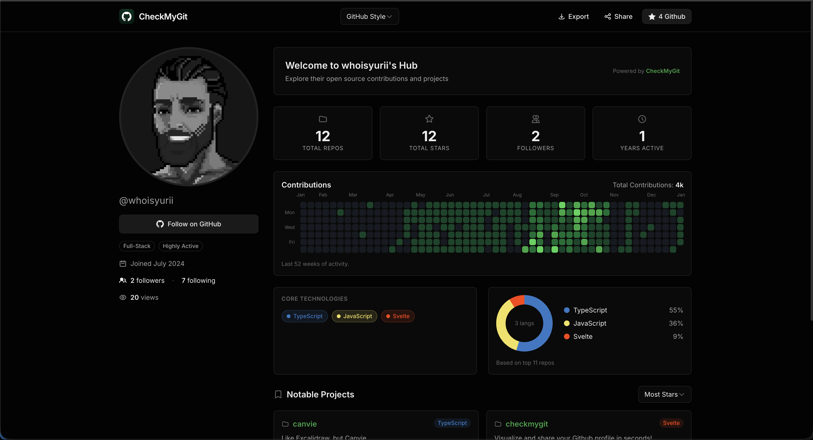

<h1 align="center">CheckMyGit</h1>

<p align="center">
  <strong>Transform your GitHub profile into a stunning static portfolio.</strong>
</p>

<p align="center">
  <a href="#features">Features</a> •
  <a href="#static-site-setup">Static Site Setup</a> •
  <a href="#tech-stack">Tech Stack</a> •
  <a href="#getting-started">Getting Started</a> •
  <a href="#deployment">Deployment</a>
</p>

---

<p align="center">
  
</p>

---

## Features

- **Static Portfolio** — Your GitHub profile as a fast, static website
- **3 Templates** — GitHub-style sidebar, Bento grid, or Minimal CV layout
- **Contribution Graph** — Full year heatmap visualization
- **Language Stats** — Donut chart breakdown of your tech stack
- **Pinned Projects** — Showcase your best repositories
- **PNG Export** — Download your portfolio as an image
- **Auto-Sync** — Scheduled builds keep your data fresh
- **GitHub Pages** — Free hosting with automatic deployment

## Static Site Setup

CheckMyGit generates a static portfolio site for a single GitHub profile. The site is built at deploy time with your latest GitHub data and automatically updates on a schedule.

### Architecture

```
┌─────────────────────────────────────────────────────────────┐
│                     GitHub Repository                        │
│                                                              │
│  Source Code ──▶ GitHub Actions ──▶ Build Process          │
│                                      │                       │
│                                      ▼                       │
│                              Fetch GitHub Data               │
│                                      │                       │
│                                      ▼                       │
│                              Static Files (build/)           │
│                                      │                       │
│                                      ▼                       │
│                              Deploy to GitHub Pages          │
└─────────────────────────────────────────────────────────────┘
```

**Key Concepts:**

- **Build-Time Data Fetching**: GitHub profile data is fetched during the build process and embedded into static HTML files
- **Scheduled Builds**: GitHub Actions automatically rebuilds your site on a schedule (default: daily) to keep data fresh
- **No Runtime API Calls**: The deployed site is purely static with no server-side processing
- **Template Switching**: Switch between templates using URL parameters (`?template=bento`)

## Tech Stack

- **Framework:** SvelteKit 2 + Svelte 5 Runes
- **Styling:** Tailwind CSS 4
- **API:** GitHub GraphQL + REST fallback
- **Deployment:** GitHub Pages with GitHub Actions
- **Adapter:** @sveltejs/adapter-static
- **Export:** html-to-image

## Getting Started

### Prerequisites

- Node.js 20 or higher
- GitHub account
- GitHub Personal Access Token

### Local Development

1. **Clone the repo**

   ```bash
   git clone https://github.com/whoisyurii/checkmygit.git
   cd checkmygit
   ```

2. **Install dependencies**

   ```bash
   npm install
   ```

3. **Set up environment variables**

   ```bash
   cp .env.example .env
   ```

   Edit `.env` and add your configuration:

   ```env
   # Required: GitHub Personal Access Token with 'read:user' scope
   GH_TOKEN=ghp_your_token_here

   # Required: Your GitHub username
   GH_USERNAME=your-username

   # Optional: Base path if deploying to a subdirectory (e.g., /repo-name)
   BASE_PATH=

   # Optional: Custom domain for GitHub Pages
   CUSTOM_DOMAIN=
   ```

4. **Configure your site**

   Edit `site.config.js` to customize your portfolio:

   ```javascript
   export default {
   	username: process.env.GH_USERNAME || 'your-username',
   	defaultTemplate: 'github', // 'github' | 'bento' | 'minimal'
   	basePath: process.env.BASE_PATH || '',
   	customDomain: process.env.CUSTOM_DOMAIN || '',
   	siteTitle: 'GitHub Portfolio',
   	siteDescription: 'My GitHub Profile Portfolio'
   };
   ```

5. **Start the dev server**

   ```bash
   npm run dev
   ```

   Open [localhost:5173](http://localhost:5173) in your browser.

6. **Build the static site**

   ```bash
   npm run build
   ```

   The static files will be generated in the `build/` directory.

7. **Preview the build**
   ```bash
   npm run preview
   ```

## Environment Variables

### Required Variables

| Variable      | Description                                         | Example         |
| ------------- | --------------------------------------------------- | --------------- |
| `GH_TOKEN`    | GitHub Personal Access Token with `read:user` scope | `ghp_abc123...` |
| `GH_USERNAME` | Your GitHub username to display                     | `octocat`       |

### Optional Variables

| Variable        | Description                           | Example                 |
| --------------- | ------------------------------------- | ----------------------- |
| `BASE_PATH`     | Base path for subdirectory deployment | `/my-portfolio`         |
| `CUSTOM_DOMAIN` | Custom domain for GitHub Pages        | `portfolio.example.com` |

### Creating a GitHub Token

1. Go to [github.com/settings/tokens](https://github.com/settings/tokens)
2. Click "Generate new token" → "Generate new token (classic)"
3. Give it a descriptive name (e.g., "CheckMyGit Portfolio")
4. Select the `read:user` scope
5. Click "Generate token"
6. Copy the token immediately (you won't see it again!)

## Deployment

### GitHub Pages Setup

1. **Fork or push this repository to your GitHub account**

2. **Configure GitHub Secrets**

   Go to your repository Settings → Secrets and variables → Actions → New repository secret

   Add the following secrets:

   | Secret Name     | Value                             | Required    |
   | --------------- | --------------------------------- | ----------- |
   | `GH_TOKEN`      | Your GitHub Personal Access Token | ✅ Yes      |
   | `GH_USERNAME`   | Your GitHub username              | ✅ Yes      |
   | `BASE_PATH`     | Base path (if needed)             | ❌ Optional |
   | `CUSTOM_DOMAIN` | Custom domain (if using)          | ❌ Optional |

3. **Enable GitHub Pages**

   Go to Settings → Pages:
   - **Source**: Select "GitHub Actions"
   - The workflow will automatically deploy on the next push

4. **Trigger the first deployment**

   Push a commit to the `main` branch or manually trigger the workflow:
   - Go to Actions tab
   - Select "Deploy to GitHub Pages" workflow
   - Click "Run workflow"

5. **Access your site**

   Your site will be available at:
   - User/Organization site: `https://username.github.io`
   - Project site: `https://username.github.io/repository-name`
   - Custom domain: `https://your-custom-domain.com` (if configured)

### Base Path Configuration

If deploying to a project repository (not `username.github.io`), you need to set the base path:

1. Add `BASE_PATH` secret in GitHub: `/repository-name`
2. Or update `site.config.js`:
   ```javascript
   basePath: '/repository-name';
   ```

### Custom Domain Setup

To use a custom domain:

1. **Add domain to GitHub Pages**
   - Go to Settings → Pages
   - Enter your custom domain
   - Follow GitHub's DNS configuration instructions

2. **Add CUSTOM_DOMAIN secret**
   - Add `CUSTOM_DOMAIN` secret with your domain (e.g., `portfolio.example.com`)
   - The workflow will automatically create a CNAME file

3. **Configure DNS**
   - Add a CNAME record pointing to `username.github.io`
   - Or add A records for GitHub Pages IPs (see [GitHub docs](https://docs.github.com/en/pages/configuring-a-custom-domain-for-your-github-pages-site))

## Automatic Updates

Your portfolio automatically updates on a schedule to keep your GitHub data fresh.

### Default Schedule

By default, the site rebuilds **daily at 00:00 UTC**.

### Custom Schedule Examples

Edit `.github/workflows/deploy.yml` to change the schedule:

```yaml
schedule:
  # Daily at midnight UTC
  - cron: '0 0 * * *'

  # Every 6 hours
  - cron: '0 */6 * * *'

  # Weekly on Monday at 00:00 UTC
  - cron: '0 0 * * 1'

  # Monthly on the 1st at 00:00 UTC
  - cron: '0 0 1 * *'

  # Weekdays at 09:00 UTC
  - cron: '0 9 * * 1-5'
```

**Cron Syntax Reference:**

```
┌───────────── minute (0 - 59)
│ ┌───────────── hour (0 - 23)
│ │ ┌───────────── day of month (1 - 31)
│ │ │ ┌───────────── month (1 - 12)
│ │ │ │ ┌───────────── day of week (0 - 6) (Sunday to Saturday)
│ │ │ │ │
* * * * *
```

### Manual Deployment

You can manually trigger a rebuild anytime:

1. Go to your repository on GitHub
2. Click the **Actions** tab
3. Select **"Deploy to GitHub Pages"** workflow
4. Click **"Run workflow"** button
5. Select the `main` branch
6. Click **"Run workflow"**

The workflow will fetch your latest GitHub data and redeploy your site.

## Template Switching

Your portfolio supports three templates:

- **GitHub** (default): Classic GitHub profile layout with sidebar
- **Bento**: Modern grid layout with cards
- **Minimal**: Clean CV-style layout

### Switching Templates

**Via URL Parameter:**

```
https://username.github.io?template=bento
https://username.github.io?template=minimal
https://username.github.io?template=github
```

**Via Configuration:**

Edit `site.config.js`:

```javascript
defaultTemplate: 'bento'; // or 'minimal' or 'github'
```

## Troubleshooting

### Build Fails with "GH_TOKEN is required"

Make sure you've added the `GH_TOKEN` secret in your repository settings.

### Build Fails with "User not found"

Check that `GH_USERNAME` secret contains a valid GitHub username.

### Site Shows 404

1. Verify GitHub Pages is enabled in Settings → Pages
2. Check that Source is set to "GitHub Actions"
3. Ensure the workflow completed successfully in the Actions tab

### Custom Domain Not Working

1. Verify DNS records are configured correctly
2. Check that CUSTOM_DOMAIN secret is set
3. Wait up to 24 hours for DNS propagation

### Data Not Updating

1. Check the Actions tab for failed workflow runs
2. Verify the schedule trigger is configured correctly
3. Manually trigger a workflow run to force an update

## Roadmap

- [ ] **Dynamic OG Images** — Satori + Resvg for custom social preview cards
- [ ] **New Templates** — Developer card, Resume/CV, Portfolio grid
- [ ] **UI Polish** — Dark/light theme toggle, animation refinements
- [ ] **PDF Export** — Download portfolio as PDF document
- [ ] **Custom Themes** — User-defined accent colors and fonts

## Contributing

Contributions welcome! Feel free to open issues or submit PRs.

## License

MIT

---

<p align="center">
  Built with SvelteKit & deployed on GitHub Pages
</p>
